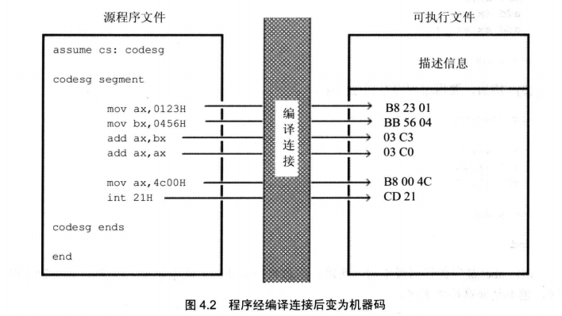
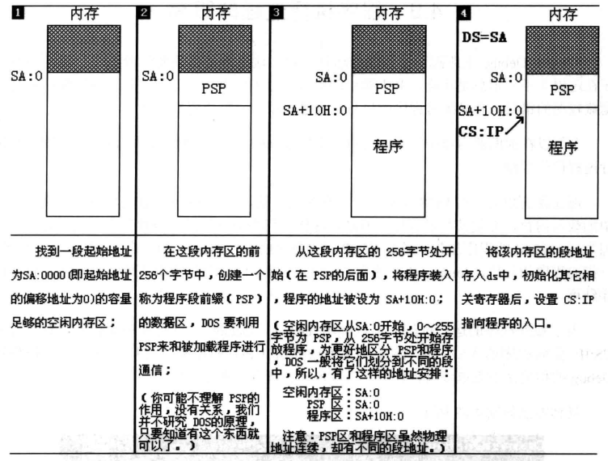

# 汇编程序

## 程序从写入到执行

1. 编写汇编程序
2. 对源程序进行编译链接
   1. 程序和数据
   2. 相关的描述信息
3. 执行可执行文件中的程序

## 格式

### 伪指令

汇编语言中的有两种指令1.汇编指令2.伪指令，汇编指令有对应的机器指令，最终被CPU执行，而伪指令没有对应的机器指令，它由编译器来执行，用来进行相关的编译工作

1. XXX segment<br>.<br>.<br>.<br>XXX ends 这是一个成对使用的伪指令。在写可被编译器编译的汇编程序必须使用的一对伪指令，他们的功能是用来描述一个段，一个段必须有一个名称(即前面的XXX)。一个有意义的程序至少要有一个段用于存放代码，需要注意的是，程序中的不同信息:指令、数据、栈是被划分在了内存中的不同区域的
2. end 是一个汇编程序的结束的标志位，编译器碰到了end则表示程序结束
3. assume 用于将有特殊功能的段与段寄存器联系起来

### 程序中的程序



### 一个完整的程序

```assembly
assume cs:cube ;将代码cube与寄存器CS联系起来

cube segment
    mov ax,2
    add ax,ax
    add ax,ax
cube ends

ends
```

### 程序的返回

一个程序返回后将CPU的控制权交给是它得以运行的程序P1,使p1能够继续运行,这个过程可以称为程序的返回.在8086汇编中程序的返回格式为

```assembly
mov ax,4c00H
int 21H
```

## 源程序的编译与调试

详见<汇编语言>第4.5节

## 程序的执行过程跟踪

在窗口中使用DEBUG `文件名.exe`按回车,DEBUG程序将从目标文件加载入内存.

1. 在程序被加载后,DS寄存器中就储存着程序所在内存的段地址,偏移地址为0
2. 这个程序的前256个字节中存放的是PSP,DOS用来和进程进行通信.从这个之后才开始是程序

### debug命令的使用

1. 使用`U`查看程序的其他指令
2. 使用T单步执行程序中的每一条指令
3. 需要使用P来执行int 21，来使程序正常的返回
4. 使用Q退出debug
