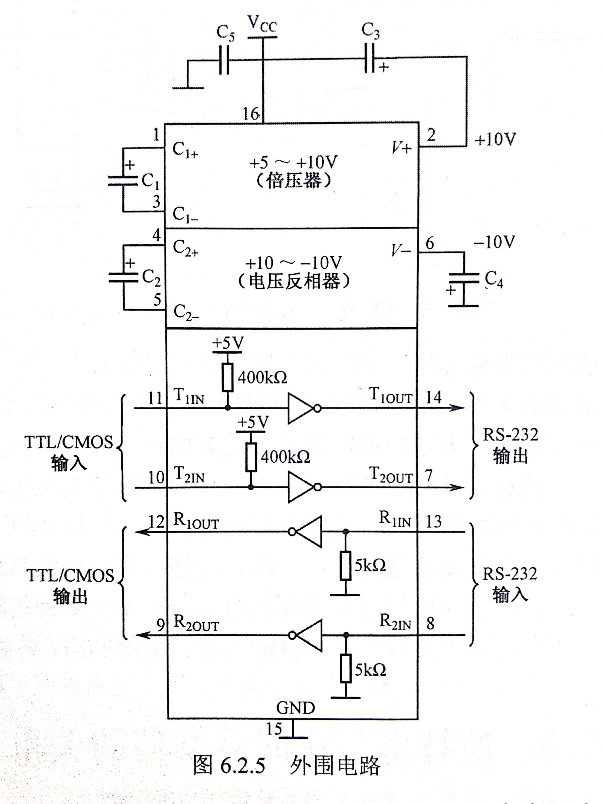

### 并行通信方式

1. 并行通信
    是指多比特数据同时通过并行线进行传送，这样数据传送速度大大提高，但并行传送的线路长度受到限制，因为长度增加，干扰就会增加，数据也就容易出错。
2. 特点
   - 各个数据位同时传输，传输速度快效率高
   - 信息不要求特定的格式
   - 抗干扰能力差
   - 适用于近距离通信
3. 常用功能
   - 实现与系统总线的连接
   - 实现与外部设备的连接
   - 具有中断请求处功能

### 串行口通信

1. 串行口通信
     使用一条数据线，将数据一位一位地依次传输，每一位数据占据一个固定的时间长度。其只需要少数几条线就可以在系统间交换信息，特别适用于计算机与计算机、计算机与外设之间的远距离通信。

2. 两种实现方式
   
   1. 异步串行通信
      
      - 通信双方以一个字符（包括特定附加位）作为数据传输单位且发送方传送字符的间隔时间不一定，具有不规则数据段传送特性的串行数据传输。（字符与字符间的空隙时间不定，字符内的每一位发出时间相同）
        为是双方收发协调，两设备的工作频率尽可能保持一致
      - 组成
          每一帧信息有四个 部分组成，分别为起始位，数据位，奇偶校验位，停止位
      - 特点
        + 容易实现，设备开销小
        + 没一帧字符需要有附加的2~3位，且中间有时间间隙，传输效率不高
   
   2. 同步串行通信
      
      - 约定的通信速率下，发送端和接收端的时钟信号频率和相位始终保持一致（同步）。此时位与位之间的距离是均为位间隔的整数倍。同时传输的字符之间不留间隙
      
      - 同步方式分为自同步和外同步
        
      
      - 其中又分为面向字符的同步格式和面向位的同步格式
        
        + 面向字符的同步格式
            传输信息和控制信息都必须由规定字符集中的字符组成
          
          > 典型的面向字符同步规程，如BSC
        
        + 面向位的同步格式
            将数据块看作是数据流，用01111110作为开头和结尾。为避免数据流中出现01111110而混乱，发送方在输出五个1后会插入一个0，接收方没检测后面有五个连续的1后接着一个0便删除这个0
          
          > 典型的面向位的同步协议有HDLC和SDLC
   
   3. 通信的制式
      
      - 单工:数据仅能沿一个方向传递，不能实现反向传输
      - 半双工: 数据可以沿两个方向传递但要分时
      - 双工: 数据可以同时进行双向传递
   
   4. 校验方式
      
      - 奇偶校验
          奇偶校验(Parity Check)是一种校验代码传输正确性的方法。根据被传输的一组二进制代码的数位中“1”的个数是奇数或偶数来进行校验。采用奇数的称为奇校验，反之，称为偶校验。采用何种校验是事先规定好的。通常专门设置一个奇偶校验位，用它使这组代码中“1”的个数为奇数或偶数。若用奇校验，则当接收端收到这组代码时，校验“1”的个数是否为奇数，从而确定传输代码的正确性。
      - 代码和校验
          产生一个字节的校验附加到数据块的末尾。接受方接受数据时同时对数据块进行求和，若所得结果和校验和一致，则传输正确
      - 循环冗余校验
          是一种根据网上数据包或计算机文件等数据产生简短固定位数校验码的一种散列函数，主要用来检测或校验数据传输或者保存后可能出现的错误。生成的数字在传输或者存储之前计算出来并且附加到数据后面，然后接收方进行检验确定数据是否发生变化

### RS-232与TTL电平的转换

1. RS232与TTL
   1. RS232
      
      - 由电子工业协会(Electronic Industries Association，EIA) 所制定的异步传输标准接口。通常 RS-232 接口以9个引脚 (DB-9) 或是25个引脚 (DB-25) 的型态出现
      - 逻辑1的电平为-3～-15V，逻辑0的电平为+3～+15V
   2. TTL
      - TTL（晶体管-晶体管逻辑电平）信号系统。这是计算机处理器控制的设备内部各部分之间通信的标准技术
      - +5V等价于逻辑“1”，0V等价于逻辑“0”(采用二进制来表示数据时)。
2. TTL电平与RS232电平的转换
   1. 分立式转换电路
      
   2. 芯片实现转换
       使用MAX232芯片进行转换。
      - 

### 波特率

1. 波特率
   
   - 波特率
     波特率表示每秒钟传送的二进制位数，是衡量数据传送速率的指标，它用单位时间内载波调制状态改变的次数来表示。  
     在信息传输通道中，携带数据信息的信号单元叫码元，每秒钟通过信道传输的码元数称为码元传输速率，简称波特率。波特率是传输通道频宽的指标。 
   
   - 单片机串行口通信中波特率的计算
       单片机的串行口有四种工作方式，其中方式0和方式2的波特率是固定的，1和3的波特率是可变的，由定时器T1的溢出率（溢出频率，使用定时器工作方式2）来决定

| 方式  | 公式                                      |
|:---:|:--------------------------------------- |
| 0   | fosc / 12                    |
| 1   | (2SMOD / 32)*(T1的溢出率)        |
| 2   | (2SMOD / 64)*fosc |
| 3   | (2SMOD / 32)*(T1的溢出率)        |

2. 电源管理寄存器
    PCON主要是为CHMOS型单片机的电源控制而设置的专用寄存器，单元地址是87H。不能够位寻址。用于管理上电复位，掉电模式，空闲模式等。单片机复位时，PCON被全部清零
   1. SMOD与单片机的破特率有关。当SMOD=0，串行通信1、2、3，波特率正常。SMOD=1时，波特率加倍
   2. GF1，GF0位通用工作标志位，用户可以自由使用
   3. PD掉电模式设定位，PD=0，单片机正常工作，PD=1，单片机进入掉电模式。由外部中断低电平或是由下降沿触发或是硬件复位模式唤醒。进入掉电模式后外部晶振停止震荡，CPU、定时器、串行口全部停止工作。只有外部中断正常工作
   4. IDL空闲模式设置位，IDL=0单片机正常工作。IDL=1,cpu不再工作，其他的中断和串行仍然工作。空闲模式下，可由任何一个中断或者是硬件复位唤醒

| 位序号                                                                                                                                                                                                                                                                                                                                                           | D7   | D6    | D5   | D4  | D3  | D2  | D1  | D0  |
|:-------------------------------------------------------------------------------------------------------------------------------------------------------------------------------------------------------------------------------------------------------------------------------------------------------------------------------------------------------------:|:----:|:-----:|:----:|:---:|:---:|:---:|:---:|:---:|
| 位符号                                                                                                                                                                                                                                                                                                                                                           | SMOD | SMOD0 | LVDF | P0F | GF1 | GF0 | PD  | IDL |
|                                                                                                                                                                                                                                                                                                                                     |      |       |      |     |     |     |     |     |
| ### 51单片机的串行口使用                                                                                                                                                                                                                                                                                                                                               |      |       |      |     |     |     |     |     |
| 1. 51单片机的接口是一个可编程的全双工通信接口具有通用异步收发器的全部功能                                                                                                                                                                                                                                                                                                                       |      |       |      |     |     |     |     |     |
| 基本结构如下                                                                                                                                                                                                                                                                                                                                                        |      |       |      |     |     |     |     |     |
|                                                                                                                                                                                                                                                                                                 |      |       |      |     |     |     |     |     |
| 单片机通过特殊功能寄存器SBUF对串行接受或是发送寄存器进行访问，两个寄存器公用一个地址99H，但在物理上是两个独立的寄存器，由指令决定访问哪一个                                                                                                                                                                                                                                                                                     |      |       |      |     |     |     |     |     |
| 2. 串行口控制寄存器SCON                                                                                                                                                                                                                                                                                                                                               |      |       |      |     |     |     |     |     |
| 1. 字节地址98H,可寻址，用于设置串行口的工作方式，接受/发送控制，及其设置状态表示等，在单片机复位后全部清零                                                                                                                                                                                                                                                                                                     |      |       |      |     |     |     |     |     |
| 2. 各位的作用                                                                                                                                                                                                                                                                                                                                                      |      |       |      |     |     |     |     |     |
| - SM0，SM1：工作方式选择位，                                                                                                                                                                                                                                                                                                                                            |      |       |      |     |     |     |     |     |
| <table><tr><td>SM0</td><td>SM1</td><td>方式</td><td>功能说明</td></tr><tr><td>0</td><td>0</td><td>0</td><td>同步移位寄存器方式，常用扩展io口</td></tr><tr><td>0</td><td>1</td><td>1</td><td>10异步收发（8位数据），波特率可变由定时器1的溢出率控制</td></tr><tr><td>1</td><td>0</td><td>2</td><td>11位异步收发（9位数据），波特率不可变</td></tr><tr><td>1</td><td>1</td><td>3</td><td>11位异步收发(9位数据)，波特率可变</td></tr></table> |      |       |      |     |     |     |     |     |
| - SM2 多机通信工作控制位                                                                                                                                                                                                                                                                                                                                               |      |       |      |     |     |     |     |     |
| 多机通信是工作于方式2和方式3，SM2位主要用于方式2和方式3。接收状态，当串行口工作于方式2或3，以及SM2=1时，只有当接收到第9位数据（RB8）为1时，才把接收到的前8位数据送入SBUF，且置位RI发出中断申请，否则会将接收到的数据放弃。当SM2=0时，不管第9位数据是0还是1，都会将数据送入SBUF，并发出中断申请。                                                                                                                                                                                           |      |       |      |     |     |     |     |     |
| 工作于方式0时，SM2必须为0。                                                                                                                                                                                                                                                                                                                                              |      |       |      |     |     |     |     |     |
| - REN 允许串行接受位                                                                                                                                                                                                                                                                                                                                                 |      |       |      |     |     |     |     |     |
| REN用于控制数据接收的允许和禁止，REN=1时，允许接收，REN=0时，禁止接收。                                                                                                                                                                                                                                                                                                                    |      |       |      |     |     |     |     |     |
| - TB8 方式2,3的发送数据的第9位，可以用软件规定其用途（如奇偶校验），在多即通信中作为地址帧/数据帧的标志位，方式0,1中该位未使用                                                                                                                                                                                                                                                                                        |      |       |      |     |     |     |     |     |
| - RB8 方式2,3的接受数据第九位，在方式1若SM2=0则为接受数据的停止位                                                                                                                                                                                                                                                                                                                      |      |       |      |     |     |     |     |     |
| - T1 发送中断标志位方式0时，发送完第8位数据后，由硬件置位，其它方式下，在发送或停止位之前由内部硬件置1，向cpu发送中断申请，需要软件操作使它清零                                                                                                                                                                                                                                                                                 |      |       |      |     |     |     |     |     |
| - R1 接受中断标志位 接受完第8位数据后，由硬件置位，其它方式下，在发送或停止位之前由内部硬件置1，向cpu发送中断申请，需要软件操作使它清零                                                                                                                                                                                                                                                                                     |      |       |      |     |     |     |     |     |
| 3. 串口方式简介                                                                                                                                                                                                                                                                                                                                                     |      |       |      |     |     |     |     |     |
| 4. 串行口方式1的实现                                                                                                                                                                                                                                                                                                                                                  |      |       |      |     |     |     |     |     |
| - 串行口通信方式1传输的每一帧数据共十位，开头一位起始位(0)，8位数据位最低位在前最高位在后，1位停止位,帧与帧之间可以有空闲也可以无空闲                                                                                                                                                                                                                                                                                       |      |       |      |     |     |     |     |     |
| 输入输出时序图                                                                                                                                                                                                                                                                                                                                                       |      |       |      |     |     |     |     |     |
|                                                                                                                                                                                                                                                                                                                         |      |       |      |     |     |     |     |     |
