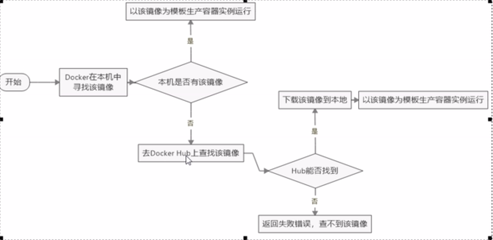

# *docker容器的使用*
## **docker的安装与基本概念**

- [查看这个](https://yeasy.gitbooks.io/docker_practice/)

## **开始使用**

1. 配置阿里云镜像服务
2. 运行hello-word
   - 运行命令docker run hello-world
     - 先在本地仓库中寻找镜像
     - 如果本地没有镜像用于创造容器实例，则从云端进行拉取
     -  
   
## **docker的底层原理**

1. 问题:
   - docker是如何工作的
   - 它为什么比虚拟机启动要快
2.   Docker是一个C-S结构系统，Docker守护进程运行在主机上，然后通过socket连接从客户端访问，守护进程从客户端接受命令并管理运行在主机上的容器
3.   docker有更少的抽象层，运行docker不需要硬件资源虚拟化，运行在docker上的程序直接使用时实际物理机资源，在cpu利用率和内存利用率上docker会有优势。
4.   docker利用的宿主虚拟机内核不需要Guest OS ，新建容器的时候不需要像虚拟机一样重新创建一个内核
   
## **docker的命令**

### **docker的帮助命令**

1. docker version   查看版本
2. docker info    更加全面的信息
3. docker --help

### **docker的镜像命令**

1. docker images    用于查看docker的所有镜像，使用repository:tag来定义不同的镜像，这个是镜像的版本标签
     - docker images -a    镜像是分层的，-a会显示中间层
     - docker images -q    显示镜像的ID
     - docker images --degests    显示镜像的摘要信息
     - docker images --no-trunc    显示完整的镜像信息
2. docker search **NameOfImages**   在[https://hub.docker.com]() 上查找相应的镜像
      - -s 点赞数
      -  --no-trunc 显示完整信息
      -  --automated 只列出自动构建的类型
3. docker pull **NameOfImages** 下载镜像
4. docker rm **NameOfImages** 删除镜像

### **docker 的容器命令**
   1. docker run [OPTION] IMAG [COMMAND] [ARGS]
      - -d 以守护式命令启动
      -  --name 返回容器ID
      - -i 以交互的形式启动容器
      - -t 为容器分配一个伪命令终端通常与-i一起使用
      - -P 随机端口映射
      - -p 指定端口映射
        - ip:hostPort:containerPort
   2. docker ps [option] 列出所有的交互式程序
      - -a 列出历史上以及现在的所有容器 
      -  -q 已经退出的容器
      -  -l 显示最近创建的容器
   3. docker restart **容器名或ID** 重启容器
   4. docker stop **容器名或ID** 停止容器
   5. docker kill **容器名或ID** 强制停止容器
   6. docker rm **容器名或ID** 删除容器
   7. 在交互进程中Ctrl +p+q容器停止但不退出，exit容器停止并退出
   8. docker top **容器名或ID** 查看容器内运行的进程
   9. docker inspect **容器名或ID** 查看容器内细节
   10. docker exec -t **容器名或ID** [option] 对docker进行操作并直接返回结果给宿主机，exec不会对容器状态进行改变
   11. docker attach **容器名或ID** 进入容器
   12. docker cp **容器路径** **宿主路径** 拷贝文件，反之依然
   13. docker commit 提交容器副本使它成为新的镜像
       - -a 作者
       - -m 描述信息  

## **docker的镜像原理**

UnionFS联合文件系统，是一种分层的，轻量级并且高效的性能文字系统，它支持对文件系统的修改做一次次的提交来进行一层层的叠加，同时将不同目录下挂载到同一个虚拟文件系统下。Union文件时Docker镜像的基础，镜像通过分层来进行维护，基于基础镜像可以制作成为各种具体的应用镜像

### **docker的镜像加载原理**

docker镜像加载实际由一层层的文件系统组成

1. bootfs主要由Bootloader和kernel，bootload主要作用时引导加载kernel，Linux刚启动的时候会加载bootfs文件系统，在Docker中最底层的是bootfs。这一层与Linux是一样的。当boot加载完成后整个内核都在内存中，此时内存的使用权由bootfs转交给内核，系统会卸载bootfs
2. roofts,在bootfs之上。包含典型的Linux系统中的文件夹目录。rootfs为各种不同版本linux的发行版

## **Docker容器数据卷**

### **Docker数据卷的基本概念**

数据卷主要完成容器间数据共享和数据持久化的操作

- 特点 
  * 数据卷可以在容器之间共享或是重用
  * 卷中的更改可以直接生效
  * 数据卷的更改不会包含在镜像的更新中
  * 数据卷的生命周期一直持续到没有容器使用为止 

### **数据卷命令**

1. docker run -it -v [宿主机绝对命令]:[容器内目录] **容器名或ID** 将宿主机目录与容器的目录联系起来
2. docker run -it -v [宿主机绝对命令]:[容器内目录] **容器名或ID**:ro 容器内目录只读 
   
### **DockerFile添加数据卷**


Dockerfile ==> Image ==> Container<br>
Dockerfile是镜像的描述语言

```dockerfile
#volume test

FROM centos
VOLUME [ "/media/qrq/QRQ_HOME/QRQ-INF/workspace","/qrqdoc"]
CMD echo "success"
CMD echo /bin/bash
```
### **数据卷容器**

命名容器挂载数据卷，其他的容器再通过挂载父容器实现数据共享。挂载数据卷的容器被称为数据卷容器<br>
docker run -it [创建的容器] --volumes-from [依赖容器]

## **DockerFile**

### **Dockerfile简介**

Docker可以通过自动读取一个Dockerfile来构建镜像。dockerfile是一个文本文档，其中包含用户可以在命令行上调用的所有来构成镜像的命令。使用docker build指令，用户可以创建一个连续执行多个命令行指令的自动构建。

### **Dockerfile的基础知识**

1. 每条保留指令后都都必须为大写字母，且之后至少跟随一个参数
2. 指令从上到下顺序执行
3. \#表示注释
4. 每条指令都会创建一个新的镜像层，并对镜像进行提交

### Docker执行Dockerfile的大致流程

1. 主要的保留字指令
   - FROM [基础镜像] 说明当前镜像时基于哪个镜像的
   - MANINTAINER 镜像维护者的姓名和邮箱地址
   - RUN 容器构建时需要运行的命令
   - EXPOSE 当期容器需要对外暴露的接口
   - WORKDIR 指定容器创建后，终端默认登录的工作目录
   - ENV 用来构建镜像过程中设置环境变量
   - ADD 拷贝并且解压缩压缩包
   - COPY
   - VOLUME
   - CMD 指定一个容器启动时需要执行的命令
     >  Dockerfile可以有多个CMD命令但只有做后一个会生效
   - ENTRYPOINT 指定容器启动时执行的命令  
2. 总结