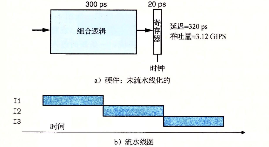
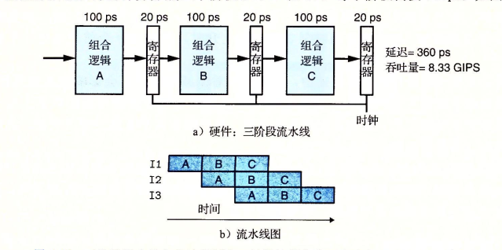
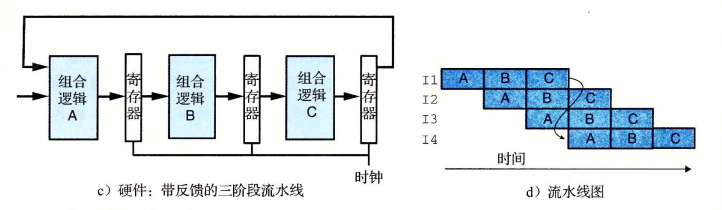
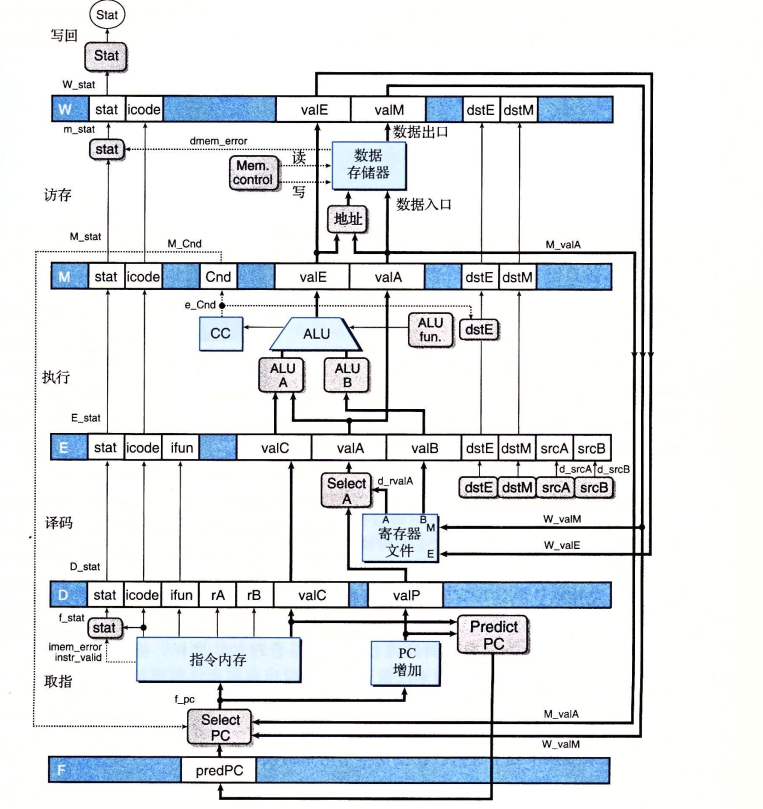
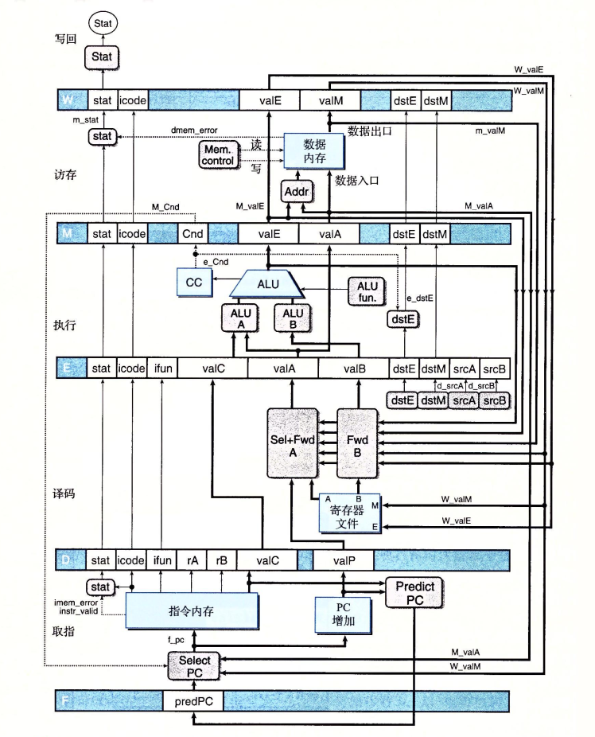

# 计算机流水线

## 计算流水线

在未流水线化的时候.当一个指令执行完,我们将结构存入寄存器,才开始下一个指令的执行.

此时,在每个周期内,硬件只有一段时间属于工作状态.为了提高系统的吞吐量

我们可以将指令分为三个阶段执行,每个阶段使用自己的寄存器记录结果,虽然这会因为寄存器数量的增加而导致电路变的复杂且延时增加,但可以有效的提高系统的吞吐量.

在每个指令的第一个阶段逻辑执行完毕,进入第二个阶段组合逻辑时,第二个指令就可以使用第一个阶段的组合逻辑了,硬件空闲的时间将减少.这还有助于减少时钟对系统的影响,各个组合逻辑之间互不干扰,可以以不同的速度执行(只有在时钟的跳变沿阶段寄存器的状态才会改变).

## 流水线的局限性

### 不一致的划分

之前在理想状态下,将流水线分为了三个等分的部分,但实际过程中每个阶段的消耗时间是不等的,同时流水线时钟的快慢是由系统最慢的阶段决定的,这会导致在一个周期的一段时间内,有一个或数个执行较快的阶段组合逻辑是空闲的.如果时钟减慢,系统的延时也将提高.

### 流水线过深反而导致效率下降

当流水线过深的时候,即讲一个组合逻辑划分为过多阶段时,会因为寄存器的增加,电路的复杂程度上升而导致延时增加,减少系统吞吐量,现代处理器一般有着15甚至更深的流水线层数.

## 带反馈的流水线问题

指令间并不是完全不相关的,有时候需要将处理结果反馈给邻近的指令.如

```assembly

 mov ax,bx    ;1
 add ax,ax    ;2
 mov cx,ax    ;3
```

其中指令2要使用指令1的结果指令,3要使用指令2的结果.在未流水线化的时候我们可以直接将每一条指令处理完的数据直接作为下一条指令的输入,但在流水线化后这个方案将出现问题.指令1的结果很可能会用在指令3甚至指令4上.这会导致流水线的计算产生错误.



## 流水线的实现

处理器对指令的执行分为几个步骤

- 取址:从内存中读取字节指令,地址为程序计数器的值(PC)
- 译码:从寄存器文件读入多个操作数,并按顺序记录这条指令的下一个地址,用于更新PC
- 执行:在执行阶段算术/逻辑执行单元要执行指令的操作
- 访存:将数据写入内存,或从内存中取数据的操作
- 写回:将数据写到寄存器中
- 更新:将PC设置为下一条指令的地址

在流水线式执行过程中,我们将更新放在第一步,并使用多个寄存器来存放上一个周期产生的控制信号,他们将被用于更新PC.这种改变被称为电路重定时,及在不改变电路逻辑的情况下改变状态表示.通常用于平衡各个流水线系统中各阶段的延时.

再在过程中加入寄存器

### 对信号进行重新排列和标号

在顺序系统中,有一些值,例如srcA,valP,valC的值唯一,而在流水线系统中,与各个指令相关联,这些值会有多个版本.我们必须在使用和写入值的时候分清版本信息,否则可能出现指令计算的结果被存放在了另一条指令的目的寄存器.每个流水线寄存器都有一个状态码字段.

> 在命名系统中,大写字母代表流水线寄存器.M_state代表寄存器M的状态码字段

在顺序执行系统中,因为没有中间阶段,不需要担心数据是否来自于同一个指令,各个阶段产生的值可以直接连在寄存器文件写端口.但在流水线模式下,为保证所使用的数据来自于同一个指令,会将值传递到下个阶段的寄存器中,穿过数个阶段,直到需要使用的阶段再使用它.<br>关于新增模块`Select A`,它的作用是减少后续的寄存器的状态数量,将valP与valA合并为valA,穿过阶段.即通过合并信号来减少寄存器状态和电路的数量

### 预测下一个PC

从理论上来讲,在上一个指令进入下一个阶段后,立马从内存中取出下一个指令,即在一个时钟周期后我们必须立马确定下一个指令的地址位置.但如果取出的是条件分支指令,则必须在多个周期后(指令通过执行阶段后)我们才能确定是否要选择分支.对于`jmp`和`call`指令来讲,下一个指令的地址是常数valC,而对于其他的指令来讲,下一个指令的地址是变量valP.对于分支指令而言,我们先对它的结果进行预测,无论执行的指令是否正确.当使用**总是选择分支**的策略时,新PC值为valC,当使用**总是不选择分支**新PC值为valP

### 流水线冒险

当流水线的前后指令有关联时,必须有一个反馈系统.指令的相关性分为两种

1. 数据相关,下一条指令会使用这一条指令的值
2. 控制相关,决定着下一条指令的位置

所以冒险也可以分为两类

1. 数据冒险
2. 控制冒险

#### 使用暂停来避免冒险

**暂停**是一种用于避免数据冒险的常用方式.暂停时,处理器会停止流水线中的一条或者多条指令,直到冒险条件不在满足为止.如让一条指令停在译码阶段直到产生它的源操作数的指令通过了会写阶段.

#### 利用转发来避免数据冒险

将结果值直接从一个流水线阶段传到较早的阶段的技术叫做数据转发技术.他使得流水线不需要任何暂停.(一般情况采用这个设计)

#### 加载/使用数据冒险

因为内存读在流水线发生的时间比较晚.不能够借助转发单独完成,此时可以使用转发加上暂停来处理数据冒险.这种方法又被称为加载互锁.因为只有加载互锁会导致流水线暂停,所以几乎可以满足一个周期一条新指令的吞吐量目标.



### 异常处理

异常可以是由程序内部产生也可以由外部产生.我们设计的指令集包含三种内部异常

1. halt指令
2. 有非法指令和功能码组合的指令
3. 取值或者数据读写试图访问非法地址

我们将导致异常称为异常指令.在更加完整的设计中,处理器会继续调用异常处理程序,这是操作系统的一部分.
