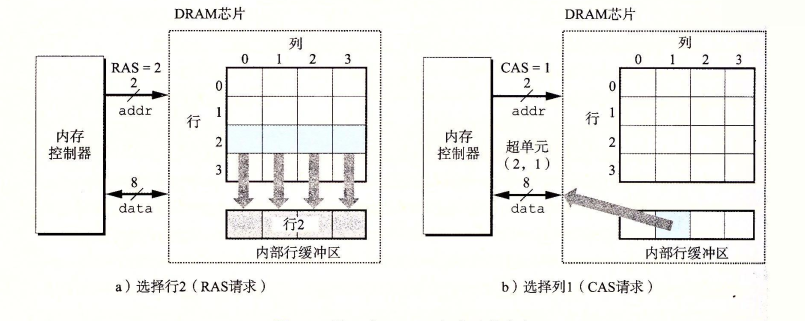
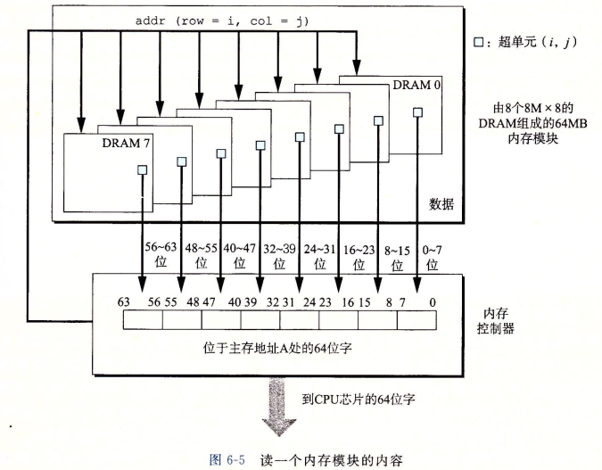
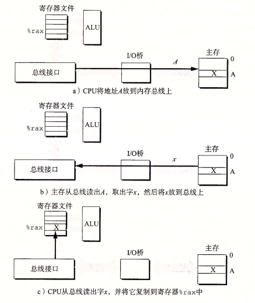

# 储存层次结构

在现代系统实际工作方式中,储存系统是一个具有不同容量,成本和访问时间的储存设备层次结构.CPU的寄存器中储存着最常用的数据，靠近CPU的小的，快速高速缓存储存器作为数据和指令的缓冲区.大容量慢速的磁盘作为数据的主储存,同时这些硬盘也会作为网络连接其他机器的磁盘上的数据的缓冲区

## 储存技术

### 随机访问储存器

随机访问储存器分为两类,静态和动态的.静态RAM比动态RAM快的多,也更贵

#### 静态RAM

SRAM将每个位储存在一个双稳态储存器中.每个单元用一个六晶体管电路来实现,这个电路的特点可以无限期的保持在其中的两种状态中不变,其他的任何状态都是不稳定的(不稳定的状态会迅速转换成稳定的状态)

#### 动态RAM

DRAM将每个储存位对一个电容进行充电,这个电容非常的小通常只有30毫微微法拉.DRAM储存器可以制造的特别密集,每个单元由一个电容和一个访问晶体管组成.但DRAM对干扰非常敏感.很多的操作会导致漏电,使得DRAM在10~100毫秒时间内失去电荷.但对于计算机以纳秒为单位的计算的运行速度而言,这依然是非常长的.内存必须周期性的读出然后重写来刷新每一位.有一些系统也会采用使用纠错码,其中计算机的字会被多编码几位,这样电路可以纠正任何单位中的错误位.

#### 传统的DRAM

DRAM芯片中的单元被分为n个`超单元`,每个超单元由w个DRAM单元组成.一个d*w的DRAM总共储存了dw位的信息. 每个DRAM芯片连接到内存控制器的电路上.这个电路可以每次传入w位数据,或者取出w位数据.例如取出超单元(2,1)时,内存控制器发送行地址2,将整个第二行复制到内存缓冲区中,接下来再由内存控制器发送列地址.

> 此处的超单元指的是DRAM阵列元素的一个叫法,计算机架构师倾向于叫它内存单元,而电路设计师倾向于叫它字

#### 内存模块

DRAM芯片封装在内存模块中.它插在主板插槽中.如图展示了从内存模块中取值的操作.现将内存的地址转换为一个超单元编号(i,j),然后由模块电路收集这些输出,并把它合成一个64位的字返回个内存控制器.

#### 增强的DRAM

#### 非易失性储存器

如果断电,DRAM和SRAM的数据都会丢失.他们被称为易失性储存.对于非易失性储存比如ROM(只读存储器),有一部分ROM是可以重编程的.闪存技术是基于EPROM发展的.它提供了一种更快的磁盘驱动器,称为固态硬盘.<br>&#9;储存在ROM中的程序通常被称为固件.复杂的设备,例如图形计算卡和磁盘驱动控制器依赖固件程序翻译来自CPU的I/O输入输出请求

#### 访问主存

数据流通过总线的共享电子电路在处理器和DRAM主存之间交互.每次CPU和主存之间的数据都是通过一系列步骤来实现的,这些步骤被称为总线事务.读事务将数据从主存读到CPU写事务将C数据写到主存.<br>&#9;当使用一下指令时发生了什么

```assembly
   mov %rax,A
```



> 总线是一组并行的导线,能携带地址信息,数据和控制信息

### 磁盘储存技术

磁盘是为了储存大量数据的储存设备.不过从磁盘上读取数据是毫秒级的,比DRAM和SRAM慢得多

#### 磁盘构造

磁盘是由盘片组成,每个盘片有两面或者称为表面,表面覆盖着磁性记录材料,盘片中央有一个可以转动的主轴,磁盘有一个或多个盘片蝶在一起,组装而成.
